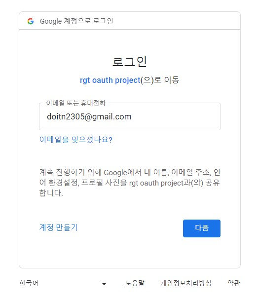
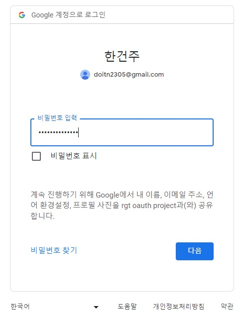
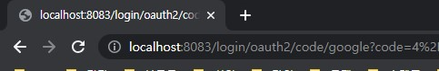
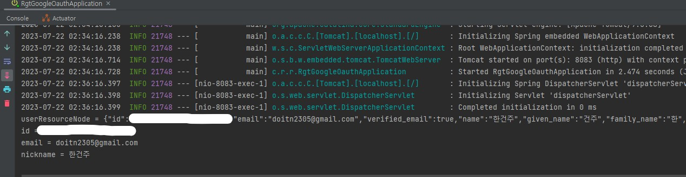
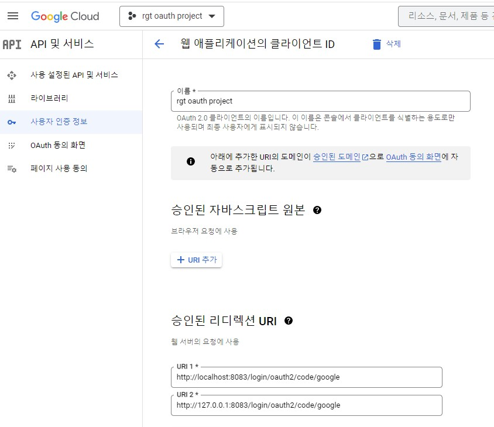

# RGT Google Oauth2.0 login 과제

### 실행 후 링크를 통한 구글 로그인 진입

아이디 입력  

비밀번호 입력  

### 로그인 성공 후 Redirect uri

구글 리디렉션 URI로 설정한 URI와 동일한 URI  

### 실행 후 console에 로그인 정보 출력

출력하도록 한 유저정보 확인

### 구글 Oauth 사용자 인증정보 리디렉션 URI
